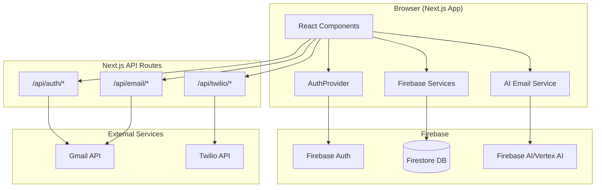
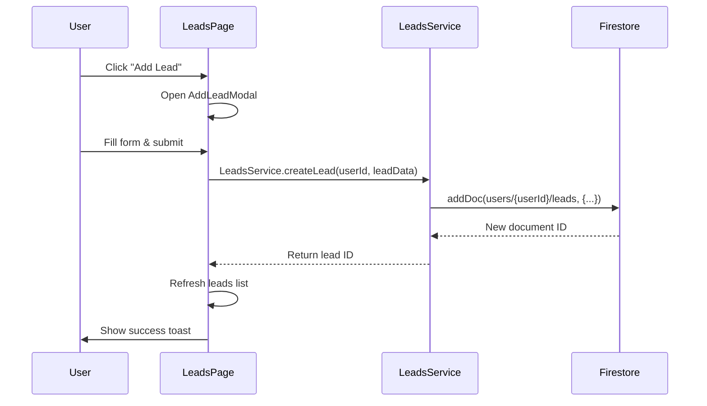
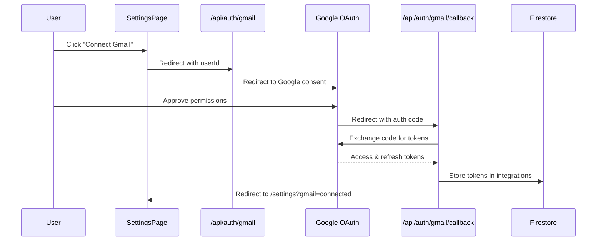
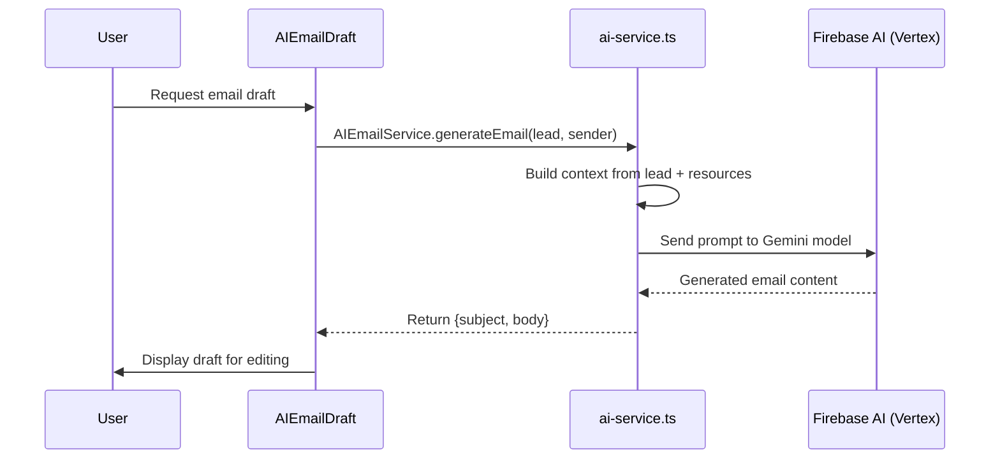

# LEADTRACKING Architecture

A Next.js 15 sales lead tracking and enablement platform with Firebase backend.

## High-Level Architecture



## Directory Structure

```
src/
├── app/                      # Next.js App Router
│   ├── layout.tsx           # Root layout with AuthProvider
│   ├── page.tsx             # Dashboard (/)
│   ├── activities/          # Activity logging
│   ├── analytics/           # Analytics dashboard
│   ├── api/                 # API Route Handlers
│   │   ├── auth/gmail/      # Gmail OAuth flow
│   │   ├── email/send/      # Send emails
│   │   └── twilio/          # Twilio SMS/Call endpoints
│   ├── leads/               # Lead management
│   ├── resources/           # Enablement resources
│   ├── settings/            # User settings & integrations
│   └── training/            # Training modules
├── components/
│   ├── ai/                  # AI-powered components
│   ├── leads/               # Lead-related modals
│   ├── providers/           # Context providers (Auth)
│   └── ui/                  # Reusable UI components
├── lib/
│   ├── firebase/            # Firebase configuration & services
│   ├── gmail/               # Gmail API utilities
│   ├── mock-data/           # Static demo data
│   └── twilio/              # Twilio service layer
└── types/
    └── index.ts             # Domain type definitions
```

## Data Model (Firestore)

### Collection Structure

```
users/{userId}/
├── leads/{leadId}           # Lead records
├── activities/{activityId}  # Activity logs
├── emailThreads/{threadId}  # Email conversation threads
├── emailMessages/{msgId}    # Individual email messages
└── integrations/{intId}     # OAuth tokens (Gmail, etc.)
```

### Entity Schemas

#### Lead
| Field | Type | Description |
|-------|------|-------------|
| `id` | string | Document ID |
| `companyName` | string | Company name |
| `contactName` | string | Contact person |
| `email` | string | Contact email |
| `phone` | string | Contact phone |
| `value` | number | Deal value |
| `status` | LeadStatus | Pipeline stage |
| `assignedTo` | string | Owner user ID |
| `industry` | string? | Industry vertical |
| `source` | string? | Lead source |
| `notes` | string? | Free-form notes |
| `tags` | string[]? | Tags for filtering |
| `lastContact` | number? | Last contact timestamp |
| `nextStep` | string? | Next action item |
| `probability` | number? | Win probability % |
| `createdAt` | number | Creation timestamp |
| `updatedAt` | number | Last update timestamp |

**LeadStatus enum**: `New` | `Contacted` | `Qualified` | `Proposal` | `Negotiation` | `Closed` | `Lost`

#### Activity
| Field | Type | Description |
|-------|------|-------------|
| `id` | string | Document ID |
| `type` | ActivityType | Activity category |
| `outcome` | ActivityOutcome | Result of activity |
| `duration` | number? | Duration in seconds (calls) |
| `timestamp` | number | When it occurred |
| `repId` | string | User who performed it |
| `leadId` | string? | Related lead |
| `notes` | string? | Notes about activity |

**ActivityType enum**: `call` | `email` | `meeting` | `social` | `demo`

**ActivityOutcome enum**: `connected` | `voicemail` | `no_answer` | `wrong_number` | `meeting_set` | `qualified` | `contract_sent` | `closed_won` | `none`

#### Resource
| Field | Type | Description |
|-------|------|-------------|
| `id` | string | Resource ID |
| `title` | string | Resource title |
| `description` | string | Description |
| `category` | ResourceCategory | Category bucket |
| `type` | ResourceType | Content type |
| `url` | string | Resource URL |
| `tags` | string[]? | Search tags |
| `updatedAt` | number | Last update |

## Request Flow Examples

### Creating a Lead



### Gmail OAuth Connection



### AI Email Generation



## External Service Dependencies

| Service | Usage | Configuration |
|---------|-------|---------------|
| **Firebase Auth** | User authentication (Google OAuth) | Project config in `.env.local` |
| **Firestore** | Primary database | Same Firebase project |
| **Firebase AI / Vertex AI** | AI email generation | Enabled in Firebase Console |
| **Gmail API** | Email sync & sending | OAuth credentials in `.env.local` |
| **Twilio** | SMS & voice calls | Account SID, Auth Token, Phone Number |

## Environment Variables

| Variable | Description |
|----------|-------------|
| `NEXT_PUBLIC_FIREBASE_API_KEY` | Firebase API key |
| `NEXT_PUBLIC_FIREBASE_AUTH_DOMAIN` | Firebase auth domain |
| `NEXT_PUBLIC_FIREBASE_PROJECT_ID` | Firebase project ID |
| `NEXT_PUBLIC_FIREBASE_STORAGE_BUCKET` | Storage bucket |
| `NEXT_PUBLIC_FIREBASE_MESSAGING_SENDER_ID` | Messaging sender ID |
| `NEXT_PUBLIC_FIREBASE_APP_ID` | Firebase app ID |
| `GOOGLE_CLIENT_ID` | Gmail OAuth client ID |
| `GOOGLE_CLIENT_SECRET` | Gmail OAuth client secret |
| `NEXT_PUBLIC_APP_URL` | Application URL |
| `TWILIO_ACCOUNT_SID` | Twilio account SID |
| `TWILIO_AUTH_TOKEN` | Twilio auth token |
| `TWILIO_PHONE_NUMBER` | Twilio phone number |

## Security Model

### Firestore Rules Summary

- **User Isolation**: Users can only access documents under their own `users/{userId}/` path
- **Authentication Required**: All operations require `request.auth != null`
- **Default Deny**: Unmatched paths return `false`
- **No Public Access**: No anonymous or public read/write allowed

### Authentication Flow

1. User clicks "Sign in with Google"
2. Firebase Auth handles OAuth flow
3. On success, `AuthProvider` stores user in React context
4. All Firebase queries include user's UID for path isolation
5. Firestore rules validate UID matches document path

## Tech Stack

| Layer | Technology |
|-------|------------|
| **Framework** | Next.js 15 (App Router) |
| **UI** | React 19, TailwindCSS 4 |
| **Language** | TypeScript (strict mode) |
| **Auth** | Firebase Auth |
| **Database** | Firestore |
| **AI** | Firebase AI / Vertex AI (Gemini) |
| **Email** | Gmail API |
| **Telephony** | Twilio |
| **Hosting** | Firebase App Hosting |
